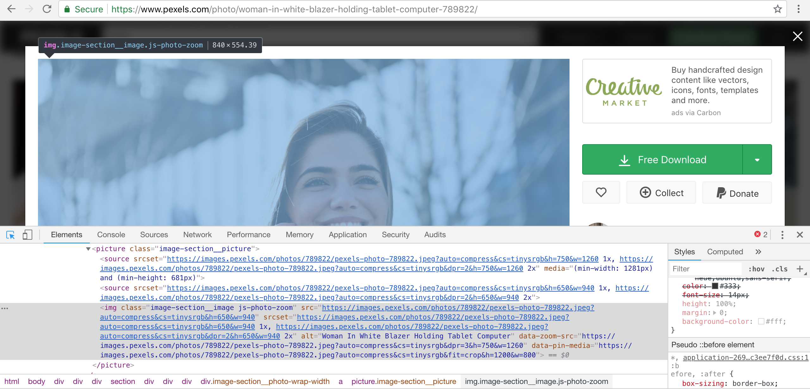
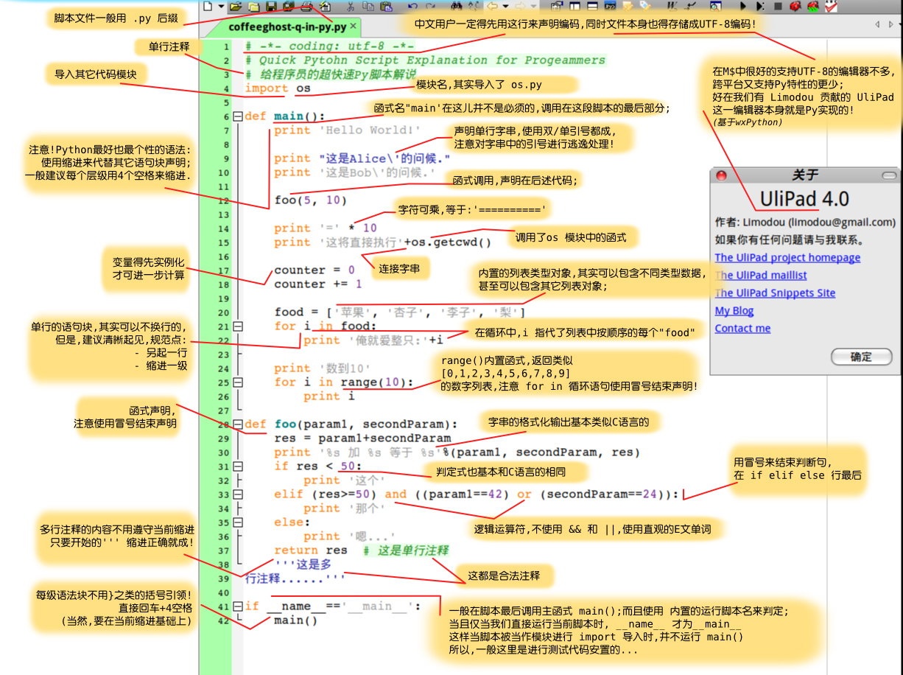

## 爬虫
一段自动抓取互联网信息的程序
> 简单爬虫架构（运行流程）  
调度端 --> URL管理器 --> 下载器 --> 解析器 --> 应用  

### PicsCrawler.py
爬取[PEXELS](https://www.pexels.com/)高清图片  

* 搜索框中输入关键字：smile，图片通过Ajax请求慢慢加载出来  
  

* 通过对url中参数的分析，构造出以下结构  
`https://www.pexels.com/search/smile/?page=2`  
其中page代表的是页数，可以对值进行改变  
  

* 找出当前页面的图片信息    

> 可以通过请求这个页面，将相关图片的链接解析出来，拿到想要的图片  
>   
>  
>    

* 选取图片进行下载，观察图片地址  
 
   

* 使用PyQuery库进行解析  
`import PyQuery as pq`  

* 获取Headers中参数值  
`Accept`：指定客户端能够接收的内容类型，内容类型中的先后次序表示客户端接收的先后次序  
> 在Prototyp（1.5）的Ajax代码封装中，将Accept默认设置为`"text/javascript, text/html, application/xml, text/xml, */*"`。这是因为Ajax默认获取服务器返回的Json数据模式。     
在Ajax代码中，可以使用XMLHttpRequest对象中setRequestHeader函数方法来动态设置这些Header信息  

`accept-encoding`：指定客户端浏览器可以支持的web服务器返回内容压缩编码类型，表示允许服务器在将输出内容发送到客户端以前进行压缩，以节约带宽；而这里设置的就是客户端浏览器所能够支持的返回压缩格式  

`User-Agent`：HTTP客户端运行的浏览器类型的详细信息。通过该头部信息，web服务器可以判断到当前HTTP请求的客户端浏览器类别  

`Cookie`：HTTP请求发送时，会把保存在该请求域名下的所有cookie值一起发送给web服务器    
> Google Universal Analytics - Cookie name(s): `_ga`, `_gid`, `_gat`, `_ga` cookie is used to distinguish unique users by assigning a randomly generated number as a client identifier. It is included in each page request in a site and used to calculate visitor, session and campaign data for the sites analytics reports. By default it is set to expire after 2 years, although this is customisable by website owners. `_gid` appears to store and update a unique value for each page visited. `_gat` - it is used to throttle the request rate - limiting the collection of data on high traffic sites. It expires after 10 minutes. Main purpose of Google Universal Analytics cookie is performance.  
   

     

* 语法  
   

  

