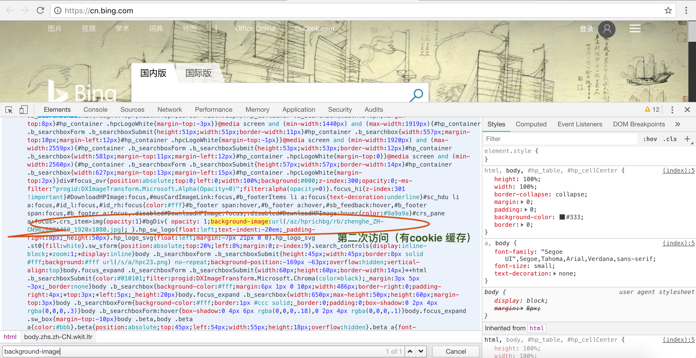
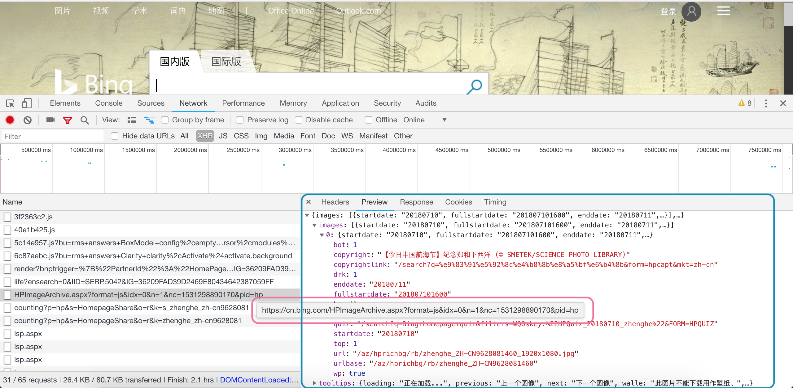
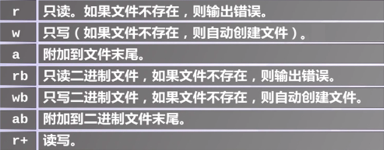

### BingWallPaper.py
爬取 [BING](https://cn.bing.com/) 壁纸


* 动态获取每日壁纸

通过访问 `http://cn.bing.com/HPImageArchive.aspx?format=xml&idx=0&n=1` 获取XML文件，里面包含了图片的地址



> `format`：返回结果的格式，非必要。不存在或者等于xml时，输出为xml格式，等于js时，输出json格式
`idx`：非必要。不存在或者等于0时，输出当天的图片，-1为已经预备用于明天显示的信息，1则为昨天的图片，idx最多获取到前16天的图片信息
`n`：必要参数。这是输出信息的数量。比如n=1，即为1条，以此类推，至多输出8条



* 使用requests获取url：`requests.get('http://cn.bing.com/HPImageArchive.aspx?format=xml&idx=0&n=1')`

* 使用[BeautifulSoup](https://www.crummy.com/software/BeautifulSoup/bs4/doc/index.zh.html)解析上述XML文件
> 获取文本内容：`.get_text()`  
标准缩进格式的结构输出： `.prettify()`

* 下载图片并保存到指定目录
```
def download_pic(url):
    filename = '/Users/wenjiasun/Python/assn2/BingPics'
    img = requests.get(url).content
    # 判断文件路径是否存在
    if not os.path.isdir(filename):
        os.mkdir(filename)
    filename = '{}/{}'.format(filename, str(datetime.datetime.now().strftime("%Y-%m-%d")) + '.jpeg')
    # 读写文件
    file = open(filename, 'wb')
    file.write(img)
    file.close()
    return filename
```

> 

> Reference：[Python中的读写文件](https://blog.csdn.net/duxu24/article/details/52900956)
* 将图片设为桌面壁纸
```
def set_desktop_background(filename):
    SCRIPT = """/usr/bin/osascript<<END
    tell application "Finder"
    set desktop picture to POSIX file "%s"
    end tell
    END"""
    # 如果把shell设置成True，指定的命令会在shell里解释执行
    subprocess.Popen(SCRIPT % filename, shell=True)
```
