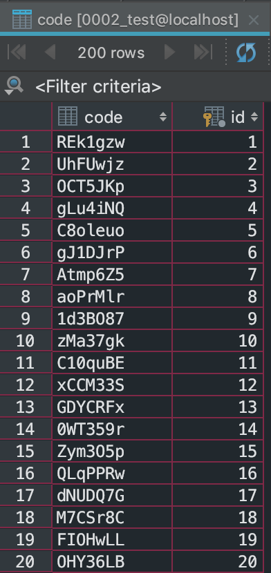

### 将 0001 题生成的 200 个激活码（或者优惠券）保存到 MySQL 关系型数据库中

```
import pymysql


def instore_mysql(file_path):
    conn = pymysql.connect(host='localhost', port=3306, user='root', password='****', db='0002_test')
    # 开启自动提交SQL，如果这里不设置，以后的命令需要执行conn.commit()来提交执行，否则都在内存中
    conn.autocommit(False)
    # 创建游标
    cursor = conn.cursor()

    # 判断表是否存在(... IF NOT EXISTS ...)
    cursor.execute('''
    CREATE TABLE IF NOT EXISTS code(
    id INT NOT NULL AUTO_INCREMENT,
    code VARCHAR(10),
    PRIMARY KEY(id)
    )
    ''')

    # wb：只读二进制文件，如果文件不存在，则输出错误
    f = open(file_path, 'rb')
    # 每次运行先清空表数据
    cursor.execute('TRUNCATE code')

    # readlines: 读取整个文件到一个迭代器以供我们遍历（读取到一个list中，以供使用，比较方便）
    for line in f.readlines():

        # print(line): bytes类型

        # print(line_decode): str类型
        line_decode = line.decode()

        # 插入数据库里的数据必须要变为list
        cursor.execute("INSERT INTO code(code) VALUES (%s);", line_decode)

    conn.commit()
    cursor.close()
    conn.close()


if __name__ == '__main__':
    instore_mysql('../0001/result.txt')
```

#### 演示
