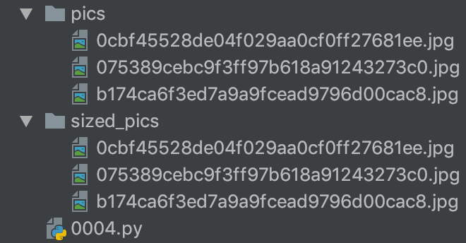

### 你有一个目录，装了很多照片，把它们的尺寸变成都不大于 iPhone5 分辨率的大小

```
import glob
import os
from PIL import Image


def thumbnail_pics(new_path):
    # recursive: 递归查找文件
    for filename in glob.glob('pics/*.jpg', recursive=True):

        # 拼接文件名字路径的函数：os.path.join()
        path1 = os.path.join(new_path, filename.split('/')[1])

        pic = Image.open(filename)

        duplicate = pic.copy()
        duplicate.thumbnail((1136, 640))
        # duplicate.show()
        duplicate.save(path1, 'JPEG')


if __name__ == '__main__':
    # ./ 当前目录; ../ 父级目录
    thumbnail_pics('/Users/wenjiasun/python/Python/demos/0004/sized_pics/')
```

#### 演示
