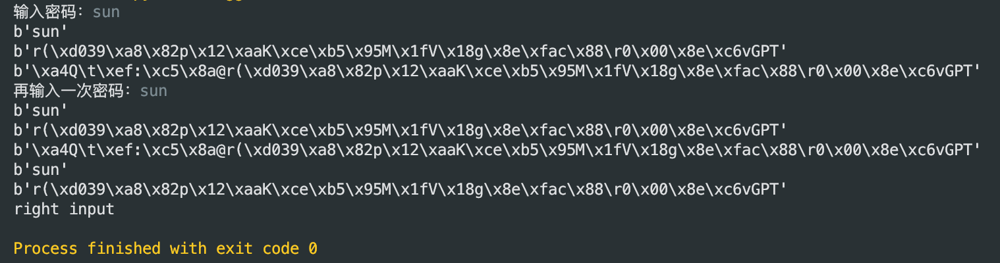

### 通常，登陆某个网站或者 APP，需要使用用户名和密码。密码是如何加密后存储起来的呢？请使用 Python 对密码加密
> 密码最好是以不可还原明文的方式来保存。通常利用哈希算法的单向性来保证明文以 不可还原的有损方式进行存储

* 加入随机 salt 的哈希算法

> 密码原文（或经过 hash 后的值）和随机生成的 salt 字符串混淆，然后再进行 hash，最后把 hash 值和 salt 值一起存储。验证密码的时候只要用 salt 再与密码原文做一次相同步骤的运算，比较结果与存储的 hash 值就可以了。这样一来哪怕是简单的密码，在进过 salt 混淆后产生的也是很不常见的字符串，根本不会出现在彩虹字典中。salt 越长暴力破解的难度越大
> 具体的 hash 过程也可以进行若干次叠代，虽然 hash 叠代会增加碰撞率，但也增加暴力破解的资源消耗。就算真被破解了，黑客掌握的也只是这个随机 salt 混淆过的密码，用户原始密码依然安全，不用担心其它使用相同密码的应用。

* 如果非要自己认证，也只能存不可逆的有损密码信息 。通过单向 hash 和 salt 来保证只有用户知道密码明文
* 绝对不能存可还原密码原文的信息 。如果因为种种原因一定要可还原密码原文，请使用非对称加密，并保管好私钥

```
def encrypt(password, salt=None):
    password = password.encode('utf-8')
    print(password)
    result = password
    if salt is None:
        salt = os.urandom(8)  # 64 bits


    for i in range(10):
        result = HMAC(result, salt, sha256).digest()
    print(result)
    return salt + result


def validate_password(hashed, input_password):
    print(encrypt(input_password, salt=hashed[:8]))
    # :8表示前8位
    return hashed == encrypt(input_password, salt=hashed[:8])


if __name__ == '__main__':
    input_password = input("输入密码：")
    hashed = encrypt(input_password)
    print(hashed)
    reput_password = input("再输入一次密码：")
    if validate_password(hashed, reput_password):
        print("right input")
    else:
        print("wrong input")
```

#### 演示
