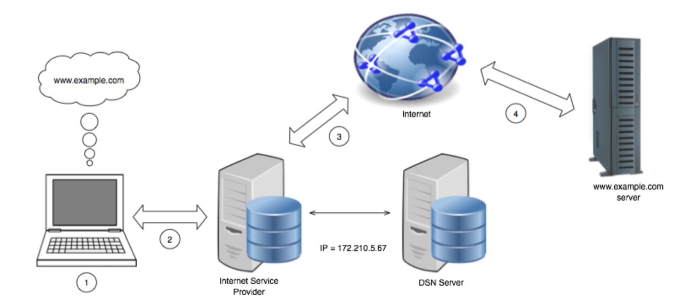
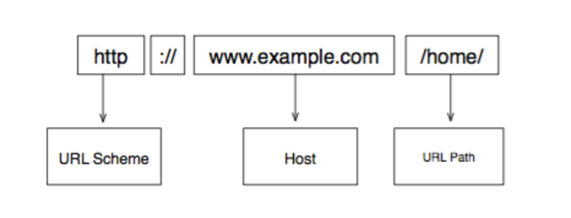
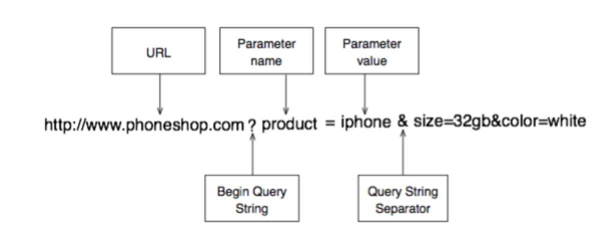
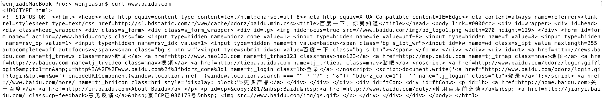
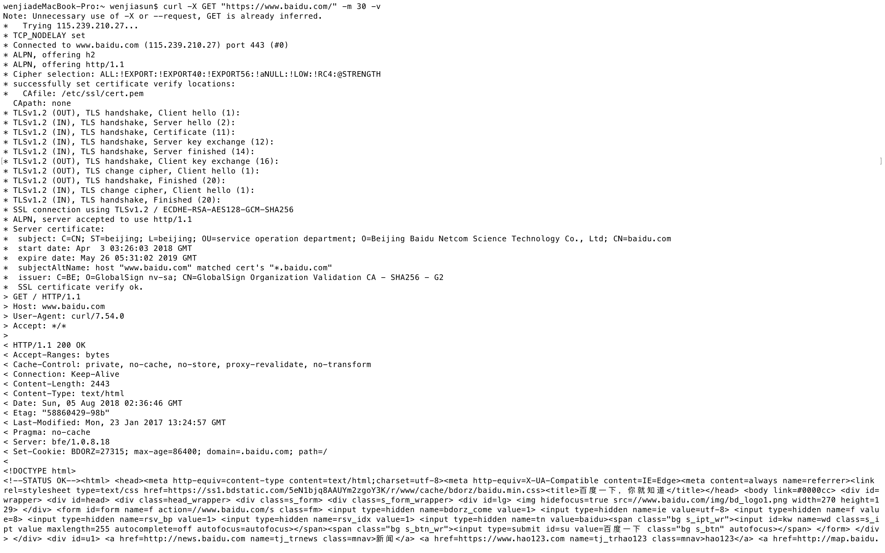
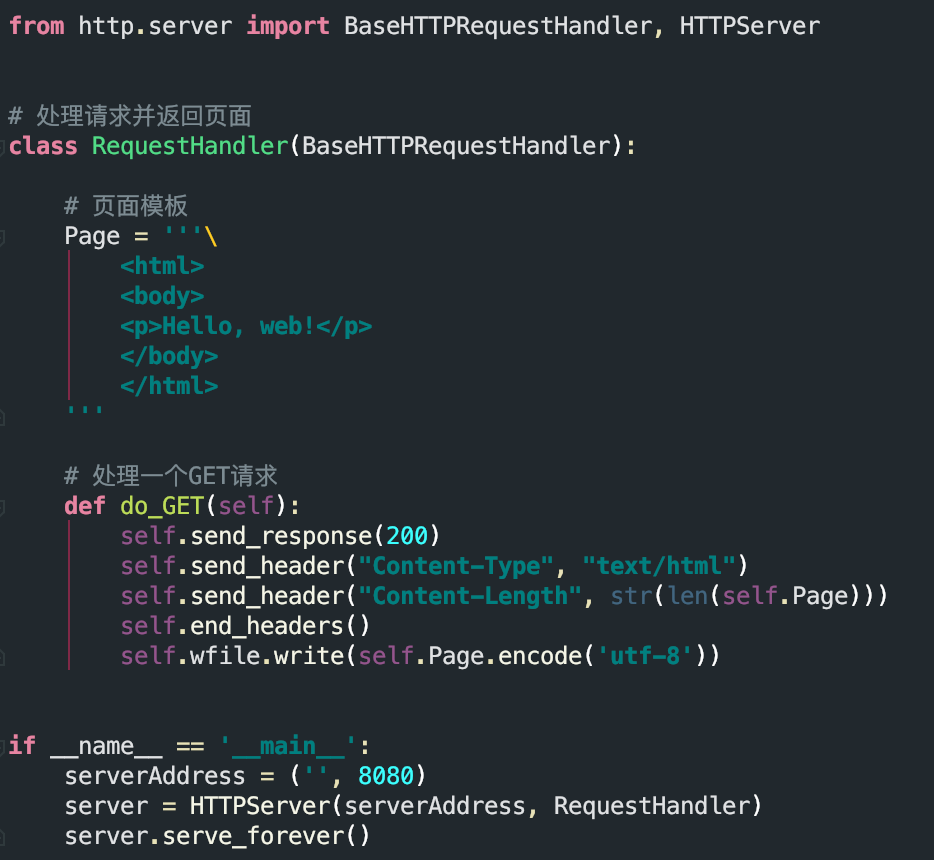
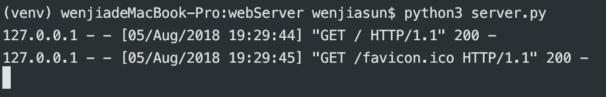
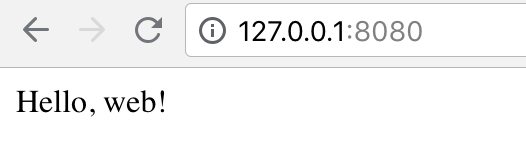

##  a simple web server in Python
> Reference：[web-server](https://github.com/aosabook/500lines/tree/master/web-server/code/00-hello-web)

### Prepare
#### Theory
* URL 和 IP 地址之间的对应由域名解析系统也就是常说的 DNS（一个分布式数据库） 来控制
* DNS 在互联网上记录 URL 和它对应的 IP 地址
* DNS 服务器集群是分层级的，如果一个 DNS 服务器里没有一个请求需要的域名，这个 DNS 服务器就会把请求转发给这个集群上更上一层节点的 DNS 服务器。最终，这个域名会在某个 DNS 服务器上的数据库里被发现，然后它对应的 IP 地址所代表的设备就会来接受这个请求

* 一般我们的web程序都运行在 TCP/IP 协议上，程序之间使用 socket 进行通信；一个 tcp socket 由一个IP地址和端口号组成
* HTTP 本质上是个无状态的互联网协议
* URL基本组成

* curl 是一个免费的命令行工具，经常被用于发送 HTTP 请求
1. `$ curl www.baidu.com`

2. `curl -X GET "https://www.baidu.com/" -m 30 -v` 看到的应该只是一个请求，一个响应包含着 HTML，但是没有自动发起的额外请求

* 常用状态码

| 状态码 | 状态文本 | 状态含义|
|:------: |:-------: |:------:|
| 200 | OK | 请求被正确处理 |
| 302 | Redirect | 所请求的资源已暂时更改.通常会重定向到另一个 URL |
| 200 | Not Found | 所请求的资源无法找到 |
| 200 | Internal Server Error | 服务器出现一般性错误 |

* session 数据是由服务器生成并存储在服务器上，session id 以 cookie 的形式发送到客户端上
* HTTPS 通过一个叫做 TLS 的加密协议来加密消息

#### Task 1
* Use `BaseHTTPServer` to handle socket connections and parse HTTP requests
* Respond to GET requests with a static 'page'

